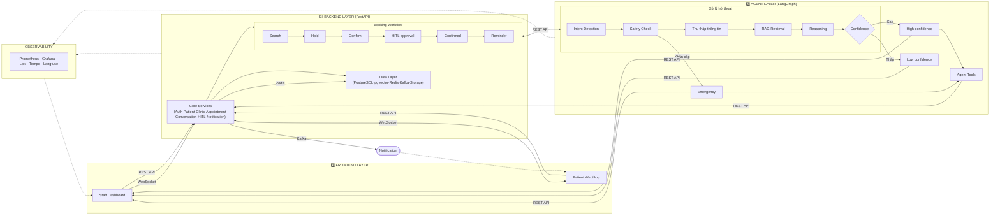
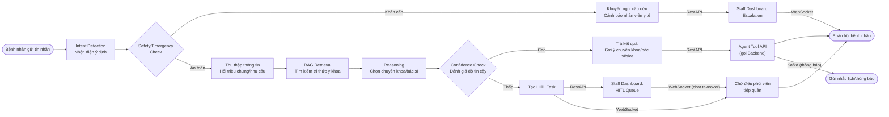
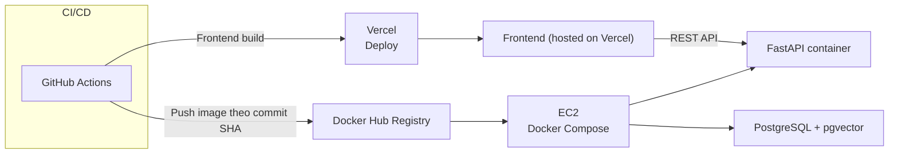

# Architecture

## System Overview

Ứng dụng hỗ trợ người bệnh tìm thông tin và đặt lịch khám qua Patient App/Web; nhân viên xử lý các yêu cầu cần can thiệp trên Staff Dashboard. FastAPI quản lý nghiệp vụ và dữ liệu, còn LangGraph điều phối hội thoại, RAG, kiểm tra an toàn và chuyển tiếp HITL khi độ tin cậy thấp hoặc phát hiện tình huống khẩn cấp.

## Architecture Diagram

## Components

### Frontend

- **Purpose:** Cung cấp giao diện cho hai nhóm người dùng — bệnh nhân (đặt lịch, chat tư vấn) và điều phối viên (duyệt lịch, xử lý HITL, chat takeover)
- **Key Features:**
  - Patient App: Chat với AI, đặt/đổi/huỷ lịch, xem hồ sơ, nhận nhắc lịch
  - Staff Dashboard: HITL Queue, duyệt lịch, chat takeover, xử lý escalation
  - Kết nối real-time qua WebSocket cho chat và cập nhật trạng thái lịch hẹn
- **State Management:**  Global store (Redux) cho session người dùng và trạng thái chat

### Backend (FastAPI)

- **Purpose:** Là lớp duy nhất ghi dữ liệu và thực thi nghiệp vụ.
- **API Design:** RESTful
- **Authentication:** JWT

### 3. AI Agent (LangGraph)

- **Agent Type:** Plan-and-Execute
- **State:** session_id, patient_id,
  conversation_history: [...],
  intent, is_emergency: bool,
  collected_info: {...},
  retrieved_context: [...],
  confidence_score: float,
  suggested_specialty, suggested_doctor, suggested_slots: [...],
  hitl_required: bool
- **Nodes:** Intent Detection → Safety/Emergency Check → Thu thập thông tin → RAG Retrieval → Reasoning → Confidence Check → (High: Suggest) / (Low: Handoff to HITL) / (Emergency: Alert)
- **Tools:** search_specialties, search_doctors, get_available_slots, hold_slot, create_appointment, reschedule_appointment, cancel_appointment, create_human_support_request
- **Flow:**

### Data & Infrastructure

- PostgreSQL là nguồn dữ liệu nghiệp vụ; pgvector lưu embedding và phục vụ RAG.
- Redis dùng cho cache và trạng thái ngắn hạn; Kafka xử lý thông báo bất đồng bộ; Object Storage lưu tài liệu.
- Alembic quản lý migration; Prometheus/Grafana, Loki/Tempo và Langfuse phục vụ quan sát hệ thống.

## Core Data Flow

1. Client gửi yêu cầu tới FastAPI qua REST hoặc WebSocket.
2. Backend xác thực, validate và chuyển hội thoại cho LangGraph.
3. Agent kiểm tra intent và an toàn, truy xuất context cần thiết rồi phân nhánh theo confidence: high confidence thì gợi ý; low confidence thì không gợi ý và chuyển điều phối viên hoặc trả message an toàn.
4. Agent tools gọi lại backend; backend cập nhật PostgreSQL/pgvector và phát sự kiện thông báo khi cần.
5. Kết quả được trả về client; trạng thái chat/HITL được cập nhật qua WebSocket.

## Booking Flow

`Search → Suggest → Patient agrees → HITL staff approval → Confirmed → Reminder`

## Deployment

Hiện tại AWS EC2 chạy Docker Compose cho backend và PostgreSQL/pgvector. GitHub Actions build/test Docker image, push image theo commit SHA lên Docker Hub; EC2 chỉ pull image từ registry rồi khởi động bằng Compose, health check và rollback khi cần. Frontend React/Vite được deploy độc lập trên Vercel. Redis, Kafka và Object Storage được tích hợp theo môi trường triển khai tương ứng.

## Security

- Không commit secret; dùng `.env`/secret store theo môi trường.
- Validate input bằng Pydantic, phân quyền theo vai trò và giới hạn CORS.
- Không để agent truy cập trực tiếp database; mọi thao tác đi qua Agent Tool API.
- Tách dữ liệu nhạy cảm khỏi log; audit các thao tác đặt lịch, HITL và escalation.

## Design Decisions

| Decision            | Choice                                | Reason                                              |
| ------------------- | ------------------------------------- | --------------------------------------------------- |
| API                 | FastAPI                               | Async, type-safe, tự sinh OpenAPI                   |
| Agent orchestration | LangGraph                             | State rõ ràng, branching và HITL                    |
| Primary database    | PostgreSQL + pgvector                 | Dữ liệu quan hệ và vector search trong một nền tảng |
| Cache / events      | Redis + Kafka                         | Giảm độ trễ và xử lý notification bất đồng bộ       |
| Deployment          | AWS EC2 + Docker Compose + Docker Hub + GitHub Actions + Vercel | Backend pull image đã kiểm thử; frontend deploy độc lập; có health check và rollback |
