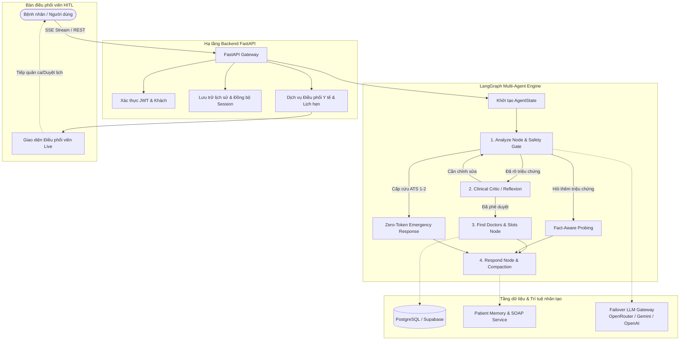

# 🏥 Vinmec Smart Medical Assistant (VMEC-01 / P-124)
> **Trợ lý Tiếp đón Y tế & Điều phối Khám Bệnh Thông minh Đa tác tử (Multi-Agent System)**  
> *Phân tầng cấp cứu ATS • Tự động phân luồng chuyên khoa • Đặt lịch qua hội thoại tự nhiên • Human-in-the-Loop Workbench*

[](https://python.org)
[](https://fastapi.tiangolo.com)
[](https://langchain-ai.github.io/langgraph/)
[](https://react.dev/)
[](https://www.typescriptlang.org/)
[](https://tailwindcss.com/)
[](https://opensource.org/licenses/MIT)

---

## 📖 Mục lục
- [1. Giới thiệu tổng quan](#1-giới-thiệu-tổng-quan)
- [2. Các tính năng cốt lõi](#2-các-tính-năng-cốt-lõi)
- [3. Kiến trúc hệ thống & Luồng xử lý](#3-kiến-trúc-hệ-thống--luồng-xử-lý)
- [4. Bảng biến môi trường (Environment Variables)](#4-bảng-biến-môi-trường-environment-variables)
- [5. Hướng dẫn cài đặt & Chạy dự án (Setup Instructions)](#5-hướng-dẫn-cài-đặt--chạy-dự-án-setup-instructions)
- [6. Kịch bản & Câu hỏi mẫu (Sample Queries)](#6-kịch-bản--câu-hỏi-mẫu-sample-queries)
- [7. Danh mục API Endpoints](#7-danh-mục-api-endpoints)
- [8. Kiểm thử & Đảm bảo chất lượng (Testing)](#8-kiểm-thử--đảm-bảo-chất-lượng-testing)
- [9. Cấu trúc thư mục dự án](#9-cấu-trúc-thư-mục-dự-án)
- [10. Đóng góp & Bản quyền](#10-đóng-góp--bản-quyền)

---

## 1. Giới thiệu tổng quan

**Vinmec Smart Medical Assistant** là giải pháp trợ lý ảo y tế toàn diện được xây dựng nhằm giải quyết bài toán quá tải tiếp đón bệnh nhân tại các bệnh viện và phòng khám đa khoa tiêu chuẩn quốc tế. Hệ thống kết hợp giữa **mô hình đồ thị tác tử (LangGraph)**, **hệ thống quy tắc phân tầng cấp cứu y khoa (Australasian Triage Scale - ATS)** và **bàn làm việc điều phối thực tế cho nhân viên y tế (HITL Workbench)**.

### Mục tiêu giải quyết:
1. **An toàn người bệnh là trên hết (Clinical Safety First):** Tự động phát hiện các ca tối khẩn (Acute STEMI, Đột quỵ, Sốc phản vệ, Suy hô hấp cấp) bằng cổng bảo vệ **Zero-Token Emergency Gate** với độ trễ nano-giây, ngăn ngừa chẩn đoán sai và hướng dẫn cấp cứu 115 ngay lập tức.
2. **Phân luồng chuyên khoa chính xác:** Định tuyến bệnh nhân đúng cơ sở y tế gần nhất (VD: Vinmec Riverside Long Biên, Vinmec Times City, Vinmec Central Park...) và đúng chuyên khoa phù hợp với triệu chứng.
3. **Tiếp nhận đặt lịch qua hội thoại (Conversational Booking Intake):** Tự nhiên trích xuất tên, số điện thoại, ngày khám tương đối ("sáng thứ 2 tuần sau"), tạo mã phiếu hẹn `YC-XXXXXX` trực tiếp vào hệ thống quản lý.
4. **Hỗ trợ điều phối viên can thiệp trực tiếp (Human-in-the-Loop):** Nhân viên y tế có thể theo dõi live phiên chat của bệnh nhân và chủ động tiếp quản (takeover) xử lý các ca phức tạp hoặc ca cần xác nhận lịch đặc biệt.

---

## 2. Các tính năng cốt lõi

* **🚨 Cổng phân tầng cấp cứu Zero-Token (ATS Level 1-5):**
  * Tách biệt hoàn toàn các triệu chứng đe dọa tính mạng (đau ngực dữ dội, vã mồ hôi, khó thở, hôn mê, co giật, méo miệng...) ra khỏi luồng xử lý LLM thông thường.
  * Phản hồi khẩn cấp tức thì (0 token tiêu tốn, latency < 10ms) đưa ra lộ trình phân tầng (Care Pipeline) và nút gọi cấp cứu khẩn cấp 115.

* **🩺 Hỏi bệnh thích ứng (Adaptive Fact-Aware Probing):**
  * Áp dụng nguyên tắc giao tiếp lâm sàng: Chỉ hỏi từng câu hỏi một, không hỏi dồn dập nhiều câu gây quá tải cho bệnh nhân.
  * Ghi nhớ các sự thật lâm sàng đã thu thập (`clinical_facts`) vào bộ nhớ phiên để không hỏi lặp lại.

* **🌐 Hỗ trợ song ngữ toàn diện (Bilingual Vietnamese & English):**
  * Tự động phát hiện và chuyển đổi ngôn ngữ linh hoạt theo ngôn ngữ bệnh nhân nhập vào.
  * Bản địa hóa toàn bộ hệ thống gợi ý chuyên khoa, cảnh báo an toàn và hướng dẫn điều phối.

* **🧠 Quản lý bộ nhớ hội thoại & Hồ sơ bệnh nhân dài hạn:**
  * **Compaction + SOAP Notes:** Nén hội thoại nhiều lượt thành bản tóm tắt bệnh án chuẩn y khoa SOAP (Subjective, Objective, Assessment, Plan), tối ưu chi phí token và tránh trôi ngữ cảnh.
  * **Cross-Session Memory:** Ghi nhớ sở thích cơ sở khám, tiền sử bệnh và các tác vụ đang chờ xử lý (`open_loops`).

* **📅 Tra cứu bác sĩ & Lịch trống thời gian thực:**
  * Đồng bộ và truy vấn trực tiếp danh sách bác sĩ, chuyên khoa và khung giờ còn trống từ cơ sở dữ liệu Supabase/PostgreSQL.

* **⚡ Failover LLM Gateway có tính sẵn sàng cao (High Availability):**
  * Cơ chế Hedged Requests & Circuit Breaker: Tự động chạy đua giữa nhà cung cấp chính (OpenRouter) và các nhà cung cấp dự phòng (Google Gemini 2.5 Flash, OpenAI).
  * Tự động cooldown provider gặp sự cố hạn ngạch hoặc lỗi kết nối.

* **📡 Trải nghiệm phản hồi mượt mà qua Server-Sent Events (SSE):**
  * Hỗ trợ streaming câu trả lời từng từ tại `POST /api/v1/chat/stream`.
  * Cơ chế tự phục hồi: Tự động fallback về REST polling `POST /api/v1/chat` nếu môi trường mạng gián đoạn SSE.

---

## 3. Kiến trúc hệ thống & Luồng xử lý



---

## 4. Bảng biến môi trường (Environment Variables)

Sao chép `.env.example` thành `.env` tại thư mục gốc và cấu hình các giá trị cần thiết:

```bash
cp .env.example .env
```

| Tên biến | Bắt buộc | Mặc định | Mô tả chi tiết |
|:---|:---:|:---|:---|
| **CẤU HÌNH LLM** | | | |
| `OPENROUTER_API_KEY` | Khuyên dùng | `""` | Khóa API OpenRouter chính (dùng cho mô hình `openai/gpt-4o-mini`). |
| `OPENROUTER_BACKUP_KEYS` | Tùy chọn | `""` | Danh sách khóa OpenRouter dự phòng, cách nhau bằng dấu phẩy. |
| `OPENROUTER_MODEL_NAME` | Tùy chọn | `openai/gpt-4o-mini` | Tên mô hình AI trên OpenRouter. |
| `GOOGLE_AI_API_KEY` | Khuyên dùng | `""` | Khóa Google AI Studio (Gemini) để tự động failover dự phòng. |
| `GOOGLE_AI_MODEL_NAME` | Tùy chọn | `gemini-2.5-flash` | Mô hình Gemini dự phòng (`gemini-2.5-flash` hoặc `gemini-2.5-pro`). |
| `OPENAI_API_KEY` | Tùy chọn | `""` | Khóa OpenAI chính thức (nếu sử dụng trực tiếp OpenAI). |
| `LLM_REQUEST_TIMEOUT_SECONDS` | Tùy chọn | `12.0` | Timeout cho từng request LLM đơn lẻ (giây). |
| `LLM_HEDGE_DELAY_SECONDS` | Tùy chọn | `3.0` | Thời gian trễ trước khi kích hoạt provider thứ 2 đua kết quả. |
| `LLM_TOTAL_TIMEOUT_SECONDS` | Tùy chọn | `15.0` | Tổng thời gian tối đa cho toàn bộ lượt gọi LLM. |
| `LLM_FAILURE_COOLDOWN_SECONDS` | Tùy chọn | `30.0` | Thời gian đóng băng tạm thời provider bị lỗi (giây). |
| **CƠ SỞ DỮ LIỆU & LƯU TRỮ** | | | |
| `DATABASE_URL` | **Có** | `sqlite:///./data/app.db` | Chuỗi kết nối PostgreSQL (hoặc SQLite cho môi trường local test). |
| `DATABASE_AUTO_CREATE` | Tùy chọn | `true` | Tự động tạo bảng ORM khi khởi động ứng dụng nếu chưa có. |
| `SUPABASE_URL` | Tùy chọn | `""` | URL dự án Supabase (nếu kết nối dữ liệu bác sĩ/dịch vụ). |
| `SUPABASE_KEY` | Tùy chọn | `""` | Anon/Public API Key của Supabase. |
| `SUPABASE_SERVICE_ROLE_KEY` | Tùy chọn | `""` | Service Role Key cho quyền truy cập quản trị Supabase. |
| **XÁC THỰC & BẢO MẬT (AUTH)** | | | |
| `JWT_SECRET_KEY` | **Có** | `replace-with-a-secret` | Khóa bí mật dùng để ký và giải mã JWT token. |
| `JWT_ALGORITHM` | Tùy chọn | `HS256` | Thuật toán băm JWT. |
| `JWT_ACCESS_TOKEN_EXPIRE_MINUTES` | Tùy chọn | `15` | Thời gian hết hạn của Access Token (phút). |
| `JWT_REFRESH_TOKEN_EXPIRE_DAYS` | Tùy chọn | `30` | Thời gian hết hạn của Refresh Token (ngày). |
| `CORS_ORIGINS` | Tùy chọn | `http://localhost:5173` | Danh sách URL frontend được phép gọi API (phân tách bởi dấu phẩy). |

---

## 5. Hướng dẫn cài đặt & Chạy dự án (Setup Instructions)

### Yêu cầu tiên quyết
* **Python:** Phiên bản `3.11` trở lên
* **Node.js:** Phiên bản `v20.x` trở lên & `npm`
* **Hệ điều hành:** Hỗ trợ Windows, macOS, Linux

---

### Bước 1: Khởi tạo Backend

1. **Tạo và kích hoạt môi trường ảo Python:**
   ```bash
   # Trên Windows (PowerShell)
   python -m venv .venv
   .\.venv\Scripts\Activate.ps1

   # Trên Linux / macOS
   python3 -m venv .venv
   source .venv/bin/activate
   ```

2. **Cài đặt các thư viện phụ thuộc:**
   ```bash
   pip install --upgrade pip
   pip install -r requirements.txt
   ```

3. **Cài đặt cấu hình môi trường:**
   Tạo file `.env` từ file mẫu `.env.example` và điền khóa API (`OPENROUTER_API_KEY` hoặc `GOOGLE_AI_API_KEY`).

4. **Khởi chạy máy chủ Backend:**
   ```bash
   python scripts/run_backend.py --host 127.0.0.1 --port 8000
   ```
   * Launcher sử dụng selector loop tối ưu tương thích với `asyncio` trên Windows.
   * Swagger UI tương tác trực tiếp tại: **<http://127.0.0.1:8000/docs>**
   * Kiểm tra tình trạng sẵn sàng: **<http://127.0.0.1:8000/health/ready>**

---

### Bước 2: Khởi tạo Frontend

Mở một cửa sổ Terminal mới:

1. **Di chuyển vào thư mục frontend & cài đặt thư viện:**
   ```bash
   cd frontend
   npm ci
   ```

2. **Khởi chạy Frontend ở chế độ phát triển (Dev Mode):**
   ```bash
   npm run dev -- --host 127.0.0.1 --port 5173
   ```
   * Mở trình duyệt tại: **<http://127.0.0.1:5173>**
   * Hệ thống tự động kết nối với backend tại cổng `8000`.

---

### Bước 3: Chạy nhanh qua Docker (Tùy chọn)

Nếu bạn đã cài đặt Docker và Docker Compose:
```bash
docker compose up --build
```
Hệ thống sẽ tự động đóng gói ứng dụng Backend và kết nối dịch vụ cơ sở dữ liệu.

---

## 6. Kịch bản & Câu hỏi mẫu (Sample Queries)

Trợ lý y tế P-124 được thiết kế đặc thù cho các tình huống tiếp đón và sàng lọc lâm sàng thực tế. Dưới đây là các nhóm câu hỏi thử nghiệm tiêu biểu:

### Kịch bản 1: Cảnh báo cấp cứu khẩn cấp (Zero-Token Emergency Gate - ATS 1)
* **Câu hỏi bệnh nhân:**
  > *"Bệnh nhân bị đau thắt ngực dữ dội, vã mồ hôi và khó thở cấp tính"*
* **Hành vi hệ thống:**
  * **0 Token LLM:** Cơ chế Regex & Clinical Lexicon ngắt ngay lập tức, không tốn thời gian gọi mô hình AI.
  * **Kết quả:** Phân loại `ATS Level 1`, hiển thị cảnh báo đỏ và lộ trình cấp cứu: Ưu tiên tối thượng gọi ngay **115** hoặc tới thẳng phòng Cấp cứu gần nhất, không chờ xếp lịch.

---

### Kịch bản 2: Hỏi bệnh đau khớp & Phân luồng cơ sở Long Biên (ATS 4-5)
* **Câu hỏi bệnh nhân:**
  > *"Chào bạn, tôi đang bị đau khớp ở đầu gối chân phải, hiện tại tôi đang gặp vấn đề về đi lại thì không biết có bệnh viện nào ở gần khu vực Long Biên - Hà Nội để tôi có thể đi khám không?"*
* **Hành vi hệ thống:**
  * Nhận diện vị trí địa lý **Quận Long Biên** $\rightarrow$ Gợi ý ngay **Bệnh viện Đa khoa Quốc tế Vinmec Riverside** (Lô H1-YT, Phúc Lợi, Long Biên).
  * Định tuyến đúng chuyên khoa: **Chấn thương chỉnh hình & Cột sống**.
  * Hỏi làm rõ (Probing): Đặt 1 câu hỏi trọng tâm về thời gian xuất hiện cơn đau hoặc tiền sử chấn thương để chuẩn bị bệnh án.

---

### Kịch bản 3: Tra cứu bác sĩ & Khung giờ khám thực tế
* **Câu hỏi bệnh nhân:**
  > *"Tôi muốn tìm bác sĩ chuyên khoa Cơ xương khớp hoặc Chấn thương chỉnh hình có lịch khám vào sáng thứ 7 tuần này ở Vinmec Times City"*
* **Hành vi hệ thống:**
  * Trích xuất cơ sở `Vinmec Times City`, chuyên khoa, thời gian `sáng thứ 7`.
  * Truy vấn cơ sở dữ liệu hiển thị thẻ thông tin bác sĩ thực tế kèm học vị (Tiến sĩ, Thạc sĩ, BSCKII) và các khung giờ còn trống để bệnh nhân lựa chọn.

---

### Kịch bản 4: Đặt lịch khám qua trò chuyện tự nhiên (Conversational Booking)
* **Câu hỏi bệnh nhân:**
  > *"Tôi muốn đăng ký khám khớp gối ở Vinmec Riverside vào sáng thứ 2 tuần sau cho Nguyễn Văn An, số điện thoại 0912345678"*
* **Hành vi hệ thống:**
  * Trích xuất tự động các thực thể: Họ tên, SĐT, ngày tương đối (`thứ 2 tuần sau` chuyển thành ngày chuẩn ISO), buổi sáng, cơ sở.
  * Tự động tạo hồ sơ tiếp nhận trên hệ thống điều phối với mã tiếp nhận định dạng `YC-XXXXXX` (VD: `YC-2449D668`).
  * Đồng bộ thông tin phiếu hẹn sang mục **Tiến trình lịch hẹn** trên giao diện bệnh nhân.

---

### Kịch bản 5: Hủy lịch hẹn khám đã đặt
* **Câu hỏi bệnh nhân:**
  > *"Tôi bận việc đột xuất nên muốn hủy lịch hẹn khám mã YC-2449D668"*
* **Hành vi hệ thống:**
  * Xác nhận thông tin và chuyển trạng thái ca sang `cancelled` (không xóa dữ liệu để phục vụ kiểm toán y tế), giải phóng slot khám cho bệnh nhân khác.

---

### Kịch bản 6: Khám bệnh đa ngữ (English Medical Triage)
* **Câu hỏi bệnh nhân:**
  > *"I have had a severe throbbing headache on my right temple for 3 days with nausea and light sensitivity."*
* **Hành vi hệ thống:**
  * Nhận diện ngôn ngữ tiếng Anh (`en`).
  * Phân tầng hướng về **Neurology Department** (Khoa Thần kinh), đưa ra khuyến cáo theo dõi dấu hiệu thần kinh khu trú hoàn toàn bằng tiếng Anh.

---

## 7. Danh mục API Endpoints

### 1. Trợ lý AI & Hội thoại (`/api/v1/chat`)
| Phương thức | Đường dẫn | Quyền hạn | Mô tả chức năng |
|:---:|:---|:---:|:---|
| `POST` | `/api/v1/chat/stream` | Công khai / User | Gửi tin nhắn và nhận phản hồi trực tiếp dạng SSE streaming. |
| `POST` | `/api/v1/chat` | Công khai / User | Endpoint chat dạng REST truyền thống (dùng khi client không hỗ trợ SSE). |
| `GET` | `/api/v1/chat/conversations` | Người dùng | Lấy danh sách các phiên trò chuyện của người dùng đăng nhập. |
| `GET` | `/api/v1/chat/conversations/{session_id}` | Công khai / User | Tải lại toàn bộ lịch sử tin nhắn của một phiên. |
| `DELETE` | `/api/v1/chat/conversations/{session_id}` | Người dùng | Xóa lịch sử phiên hội thoại. |

### 2. Quản lý Đặt lịch khám (`/api/v1/bookings`)
| Phương thức | Đường dẫn | Quyền hạn | Mô tả chức năng |
|:---:|:---|:---:|:---|
| `GET` | `/api/v1/bookings/my` | Bệnh nhân | Lấy danh sách lịch hẹn cá nhân (cả đặt lịch trực tiếp & qua AI chat). |
| `POST` | `/api/v1/bookings` | Bệnh nhân | Tạo yêu cầu đặt lịch hẹn mới theo khung giờ cụ thể. |
| `POST` | `/api/v1/bookings/{id}/confirm` | Bệnh nhân | Xác nhận và thanh toán/chốt slot khám đang giữ chỗ. |
| `POST` | `/api/v1/bookings/{id}/cancel` | Bệnh nhân / Staff | Hủy lịch hẹn khám, chuyển trạng thái sang đã hủy kèm lý do. |

### 3. Bàn làm việc Điều phối viên (`/api/v1/workbench`)
| Phương thức | Đường dẫn | Quyền hạn | Mô tả chức năng |
|:---:|:---|:---:|:---|
| `GET` | `/api/v1/workbench/cases` | Nhân viên điều phối | Xem danh sách các ca bệnh cần xử lý, lọc theo mức khẩn cấp ATS. |
| `POST` | `/api/v1/workbench/cases/{id}/claim` | Nhân viên điều phối | Nhận phụ trách ca bệnh nhân để tiếp quản hỗ trợ. |
| `POST` | `/api/v1/workbench/cases/{id}/takeover` | Nhân viên điều phối | Bật chế độ can thiệp con người (Human Takeover) tạm dừng phản hồi của AI. |

### 4. Hệ thống & Giám sát (`/health`)
| Phương thức | Đường dẫn | Quyền hạn | Mô tả chức năng |
|:---:|:---|:---:|:---|
| `GET` | `/health` | Công khai | Kiểm tra máy chủ có đang phản hồi (Liveness check). |
| `GET` | `/health/ready` | Công khai | Kiểm tra kết nối cơ sở dữ liệu PostgreSQL (Readiness check). |

---

## 8. Kiểm thử & Đảm bảo chất lượng (Testing)

Dự án trang bị bộ kiểm thử tự động toàn diện với hơn **160+ test cases** bao phủ kiểm định lâm sàng, quy tắc an toàn và kiểm thử tích hợp API:

```bash
# 1. Chạy toàn bộ test suite của Medical Assistant
pytest tests/test_medical_assistant/ -v

# 2. Kiểm thử riêng các ca cấp cứu và an toàn lâm sàng
pytest tests/test_medical_assistant/test_emergency_safety_v3.py -v

# 3. Kiểm thử luồng hội thoại đặt lịch tự nhiên
pytest tests/test_medical_assistant/test_relative_date_and_booking_summary.py -v

# 4. Kiểm thử API hủy lịch và đặt chỗ
pytest tests/test_booking/test_api.py -v

# 5. Kiểm tra định dạng code với Ruff
ruff check .
```

---

## 9. Cấu trúc thư mục dự án

```
├── .env.example                     # Mẫu biến môi trường
├── requirements.txt                 # Danh mục thư viện Python
├── scripts/
│   ├── run_backend.py               # Launcher khởi động backend đa nền tảng
│   └── setup_hooks.ps1              # Hook ghi nhận lịch sử AI
├── src/
│   ├── main.py                      # Điểm vào chính của ứng dụng FastAPI
│   ├── config.py                    # Quản lý cài đặt cấu hình Pydantic
│   ├── api/                         # Các router REST API
│   │   ├── endpoints/
│   │   │   ├── booking.py           # Quản lý lịch hẹn & Hủy lịch
│   │   │   ├── workbench.py         # Bàn làm việc điều phối HITL
│   │   │   ├── auth.py              # Đăng ký, đăng nhập & JWT
│   │   │   └── notification.py      # Thông báo đẩy
│   ├── db/                          # Kết nối cơ sở dữ liệu SQLAlchemy & Session
│   ├── models/                      # Các bảng ORM (User, Booking, Case, Specialty...)
│   ├── services/                    # Tầng logic nghiệp vụ
│   └── medical_assistant/           # Gói tác tử y tế LangGraph VMEC-01
│       ├── config.py                # Cấu hình riêng cho Agent & LLM
│       ├── agent/
│       │   ├── graph.py             # Định nghĩa đồ thị trạng thái StateGraph
│       │   ├── state.py             # Schema TypedDict của AgentState
│       │   └── nodes/               # Các node xử lý chuyên sâu
│       │       ├── analyze_node.py  # Phân tích triệu chứng, an toàn & intent
│       │       ├── critic_node.py   # Phản biện lâm sàng (Reflexion)
│       │       ├── doctor_node.py   # Truy vấn danh sách bác sĩ & slot
│       │       └── respond_node.py  # Tạo câu trả lời & Nén bộ nhớ SOAP
│       ├── domain/                  # Logic nghiệp vụ y khoa
│       │   ├── disease_triage.py    # Phân tầng cấp cứu ATS
│       │   ├── booking_lookup_service.py # Xử lý đặt lịch qua hội thoại
│       │   └── patient_memory_service.py # Bộ nhớ dài hạn bệnh nhân
│       └── infrastructure/
│           └── llm.py               # Failover LLM Gateway (Hedged requests)
├── frontend/                        # Ứng dụng giao diện người dùng
│   ├── package.json
│   ├── vite.config.ts
│   └── src/
│       ├── features/
│       │   ├── chat/                # Khung chat tư vấn AI & Live Coordination
│       │   └── appointment-progress/# Quản lý & Theo dõi tiến trình lịch hẹn
│       └── App.tsx
├── tests/                           # Bộ kiểm thử tự động Pytest
└── docs/                            # Tài liệu kiến trúc và hướng dẫn kỹ thuật
```

---

## 10. Đóng góp & Bản quyền

Dự án được phát triển theo tiêu chuẩn giáo dục và ứng dụng thực tiễn của chương trình **VinUni AI20K Build Phase**.
Mọi đóng góp, báo cáo lỗi và đề xuất vui lòng tuân thủ theo tài liệu [CONTRIBUTING.md](CONTRIBUTING.md) và [SECURITY.md](SECURITY.md).

**Giấy phép bản quyền:** [MIT License](LICENSE) — Được phép sử dụng và mở rộng cho mục đích giáo dục và nghiên cứu khoa học y tế.
