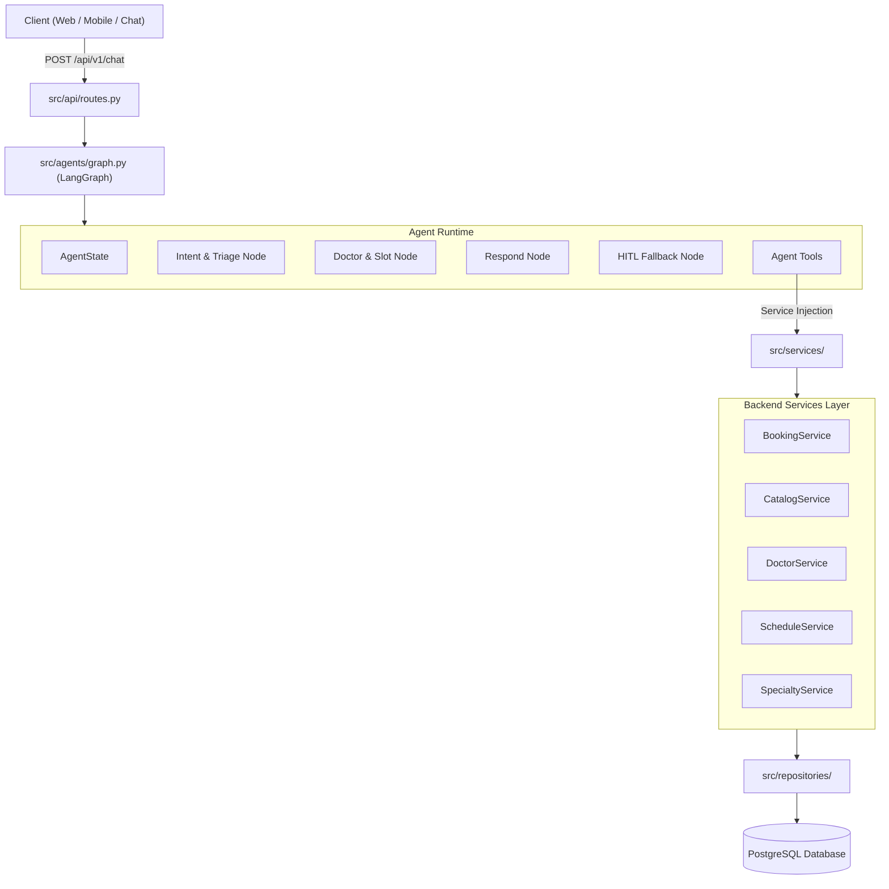

# HƯỚNG DẪN TÍCH HỢP AGENT VÀO HỆ THỐNG P124-DEV (DEVELOP BRANCH)

Tài liệu này cung cấp bức tranh toàn cảnh về kiến trúc hệ thống hiện tại của nhánh **`develop`** ([P124-Dev](file:///d:/AI%20in%20Action/LogAgent/P124-Dev)), quy định cách thức lớp **AI Agent (LangGraph)** kết nối và tương tác với lớp **Backend Services (FastAPI + SQLAlchemy + PostgreSQL)**.

---

## 1. TỔNG QUAN KIẾN TRÚC P124-DEV

Nhánh `develop` được tổ chức theo kiến trúc **Domain-Driven Design (DDD) phân lớp chuẩn mực**, tách bạch rõ ràng giữa:
1. **API Layer (`src/api/`):** Khai báo các REST routes, xử lý validation và exception handlers.
2. **Domain Services Layer (`src/services/`):** Thực thi toàn bộ nghiệp vụ lõi (Booking, Catalog, Doctor, Schedule, Auth, LLM).
3. **Repository Layer (`src/repositories/`):** Tầng truy xuất dữ liệu độc lập, bọc quanh SQLAlchemy AsyncSession.
4. **Data Models & Schemas (`src/models/`, `src/schemas/`):** SQLAlchemy ORM models và Pydantic schemas.
5. **Agent Layer (`src/agents/`):** Đồ thị LangGraph (`graph.py`, `state.py`, `nodes/`, `tools/`).



---

## 2. MA TRẬN ÁNH XẠ: AGENT TOOLS <-> BACKEND SERVICES

Khi triển khai các tool cho Agent trong `src/agents/tools/`, lập trình viên **phải tái sử dụng trực tiếp các Service và Repository đã có** trong `src/services/`, không tự viết truy vấn raw SQL tùy tiện:

| Agent Tool Name | Mục đích nghiệp vụ | Backend Service / Method tương ứng | Model liên quan |
| :--- | :--- | :--- | :--- |
| `search_specialties` | Tra cứu danh sách hoặc tìm chuyên khoa phù hợp | `SpecialtyService(session).list_specialties()` | `Specialty` |
| `search_doctors` | Tìm kiếm bác sĩ theo chuyên khoa, cơ sở, tên | `DoctorService(session).search_doctors(specialty_id, facility_id)` | `Doctor`, `DoctorSpecialty` |
| `get_available_slots` | Lấy các khung giờ khám còn trống của bác sĩ | `ScheduleService(session).get_available_slots(doctor_id, date)` | `DoctorSchedule` |
| `hold_booking_slot` | Tạm giữ chỗ lịch khám 15 phút (khóa concurrency) | `BookingService(session).create(user_id, booking_in)` | `Booking`, `DoctorSchedule` |
| `request_human_support` | Chuyển ca sang hàng đợi duyệt/takeover của Lễ tân | `BookingService(session).create_pending_review()` | `Booking (status=PENDING_REVIEW)` |
| `get_facility_info` | Tra cứu địa chỉ, hotline, chi nhánh bệnh viện | `FacilityService(session).list_facilities()` | `Facility` |

---

## 3. ĐẶC TẢ AGENT STATE CHUẨN TRONG P124-DEV

Hiện tại file [src/agents/state.py](file:///d:/AI%20in%20Action/LogAgent/P124-Dev/src/agents/state.py) đang ở dạng khởi tạo cơ bản. Khi nâng cấp thành Agent hoàn chỉnh theo [ARCHITECTURE.md](file:///d:/AI%20in%20Action/LogAgent/P124-Dev/ARCHITECTURE.md), `AgentState` sẽ bao gồm các trường dữ liệu sau:

```python
from __future__ import annotations
from typing import TypedDict, List, Optional, Dict, Any

class AgentState(TypedDict, total=False):
    # Context định danh phiên
    session_id: str
    user_id: Optional[str]
    patient_name: Optional[str]
    patient_phone: Optional[str]

    # Lịch sử hội thoại & truy vấn
    query: str
    conversation_history: List[Dict[str, str]]
    
    # Kết quả phân loại & lâm sàng (Triage)
    intent: str                          # "triage", "book_appointment", "faq", "human_handoff"
    is_emergency: bool                   # True nếu phát hiện cờ đỏ cấp cứu (ATS 1-2)
    ats_level: Optional[int]             # ATS 1 đến 5
    urgency_tier: Optional[str]          # "EMERGENCY", "URGENT", "ROUTINE"
    max_booking_days: Optional[int]      # Giới hạn số ngày được đặt trước
    suggested_specialty_id: Optional[str]
    suggested_specialty_name: Optional[str]
    collected_symptoms: List[str]        # Tối đa 4 triệu chứng gần nhất
    probing_count: int                   # Số lượt hỏi làm rõ (tối đa 2 lượt)

    # Đề xuất bác sĩ & lịch hẹn
    suggested_doctor_id: Optional[str]
    suggested_doctor_name: Optional[str]
    suggested_slots: List[Dict[str, Any]]
    held_booking_id: Optional[str]
    
    # An toàn & Giám sát (HITL)
    confidence_score: float              # 0.0 - 1.0 (Ngưỡng an toàn: >= 0.8)
    hitl_required: bool                  # True nếu cần nhân viên tiếp quản
    hitl_reason: Optional[str]
    
    # Đầu ra trả về client
    response: str
    medical_disclaimer: str
    metadata: Dict[str, Any]
    error: Optional[str]
```

---

## 4. QUY TẮC BẢO MẬT & ĐỒNG BỘ CONCURRENCY

1. **Khóa lịch khám (Slot Locking):**
   - Khi gọi `BookingService.create()`, hệ thống sử dụng khóa bi quan `get_schedule_for_update()` (row-level lock `SELECT FOR UPDATE`) để đảm bảo không bị trùng lịch (double-booking).
   - Agent tuyệt đối không tự sinh mã booking giả lập mà phải luôn gọi thông qua `BookingService`.

2. **Cơ chế HITL (Human-In-The-Loop):**
   - Khi `confidence_score < 0.8` hoặc khi người dùng có yêu cầu phức tạp ngoài phạm vi y tế, Agent thiết lập `hitl_required = True`.
   - Yêu cầu được đẩy vào hàng đợi duyệt của nhân viên tại Staff Dashboard (`/api/v1/staff/bookings`).

3. **Cờ đỏ cấp cứu (SAF-01):**
   - Khi `is_emergency = True`, Agent **dừng ngay lập tức** toàn bộ quy trình đặt lịch hoặc tìm kiếm bác sĩ, trả về chỉ dẫn cấp cứu 115 và gợi ý cơ sở cấp cứu gần nhất theo quy định tại [RULES.md](file:///d:/AI%20in%20Action/LogAgent/P124-Dev/context_agent/RULES.md).

---

## 5. HƯỚNG DẪN KIỂM THỬ VÀ CHẠY DỰ ÁN

### 5.1 Khởi động Backend
```powershell
# Chạy ứng dụng FastAPI
uvicorn src.main:app --reload --port 8000
```
Swagger UI kiểm thử: `http://localhost:8000/docs`

### 5.2 Chạy Migration Cơ sở dữ liệu
```powershell
# Nâng cấp database schema lên phiên bản mới nhất
alembic upgrade head
```

### 5.3 Chạy Test Suite
```powershell
# Chạy toàn bộ test
pytest tests/ -v

# Chạy riêng test cho agent
pytest tests/test_agents/ -v
```
