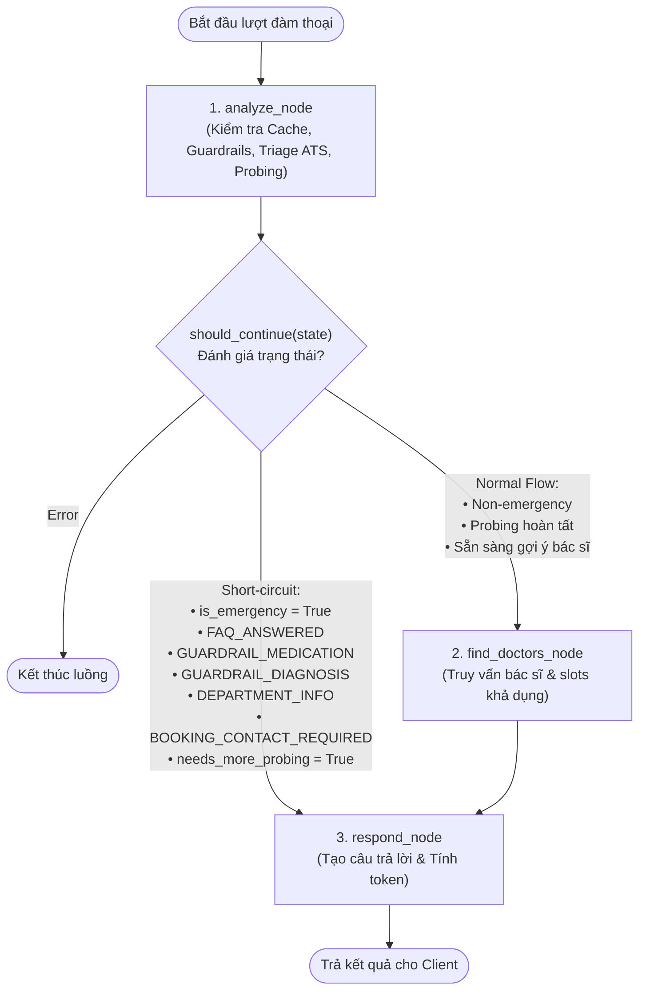

# QUY TRÌNH VẬN HÀNH & SƠ ĐỒ QUYẾT ĐỊNH (WORKFLOWS.MD)

Tài liệu này mô tả chi tiết logic điều phối luồng hội thoại của Agent qua đồ thị trạng thái **LangGraph StateGraph** trong `truong-doing/src/medical_assistant/agent/graph.py`.

---

## 1. SƠ ĐỒ ĐIỀU PHỐI ĐỒ THỊ TRẠNG THÁI (STATEGRAPH ARCHITECTURE)

Đồ thị gồm 3 node chính với bộ điều hướng rẽ nhánh có điều kiện `should_continue`:



---

## 2. QUY TRÌNH XỬ LÝ TỪNG BƯỚC (STEP-BY-STEP WORKFLOW)

### Giai đoạn 1: Phân tích & Lọc đa tầng tại `analyze_node`
Mỗi tin nhắn người dùng được đưa qua 6 cổng kiểm soát tuần tự, chặt chẽ:

1. **Cổng -1 — Tường lửa Bảo mật & Anti-Attack Gateway:**
   - Quét Prompt Injection, Jailbreak, System Prompt Exfiltration, Shell/SQL và giải mã De-obfuscation (Morse, Hex, Binary, Base64, Leet).
   - Nếu phát hiện vi phạm: Set `workflow_status = "SECURITY_BLOCKED"`, short-circuit ngay tới `respond_node` (0 token LLM).
2. **Cổng 0A — Emergency Safety Gate & Cờ Đỏ ACS / Tối Khẩn:**
   - Chạy **trước** Cache và LLM để đảm bảo tính mạng người bệnh.
   - Nhận diện tức thì cờ đỏ nhồi máu cơ tim (ACS: đau ngực + lan tay trái/hàm + vã mồ hôi lạnh + khó thở khi gắng sức) và 9 nhóm cờ đỏ đe dọa sinh mạng.
   - Kết hợp `ClinicalNegationService` để loại trừ các câu phủ định (*"không đau ngực"*).
   - Nếu phát hiện cấp cứu: Set `is_emergency = True`, `ats_level = 1`, `workflow_status = "EMERGENCY"`, `max_booking_days = 0`, short-circuit ngay tới quy trình 115!
3. **Cổng 0B — Smart Zero-Token FAQ Cache:**
   - Đối soát chuỗi truy vấn với bộ nhớ đệm câu hỏi hành chính/chính sách/giá/giờ làm việc.
   - **Quy tắc an toàn:** Tự động bỏ qua `GREETING` cache nếu người dùng có kèm triệu chứng lâm sàng.
   - Nếu hit cache: Set `workflow_status = "FAQ_ANSWERED"`, gán câu trả lời sẵn, short-circuit tới `respond_node`.
4. **Cổng 1 — Clinical Guardrails & Intent Check:**
   - Kiểm tra yêu cầu đặt lịch/slot: chỉ chấp nhận UUID lịch đã xuất hiện trong phiên và được database xác minh; sau đó chuyển sang `BOOKING_CONTACT_REQUIRED`.
   - Kiểm tra hỏi thuốc: Nếu có -> Set `workflow_status = "GUARDRAIL_MEDICATION"`.
   - Kiểm tra hỏi chẩn đoán: Nếu có -> Phân tầng triệu chứng và set `workflow_status = "GUARDRAIL_DIAGNOSIS"`.
   - Kiểm tra hỏi thông tin khoa: Nếu có -> Set `workflow_status = "DEPARTMENT_INFO"`.
   - Kiểm tra yêu cầu đi khám chung chung: Nếu có -> Set `workflow_status = "VISIT_PURPOSE_CLARIFICATION"`.
5. **Cổng 2 — Hybrid Clinical Fact Extraction & Confidence Router:**
   - Tầng 1: Rule Engine trích xuất dữ kiện chuẩn y tế (< 0.1ms, 0 token).
   - Tầng 2: Small LLM (`gpt-4o-mini` structured output) trích xuất sắc thái ngôn ngữ đời thường, cấu trúc đa mệnh đề và triệu chứng phủ định khi độ phức tạp cao.
   - Hợp nhất an toàn vào `clinical_facts` (bảo toàn quyền phán quyết của Rule Engine).
6. **Cổng 3 — Đánh giá Lâm sàng ATS (Clinical Triage Engine v3) & Fact-Aware Probing:**
   - Nối triệu chứng vào sliding window (`collected_details`, tối đa 4 mục).
   - Xác định chuyên khoa lâm sàng (`suggested_department_name`) và mức độ khẩn cấp (ATS Level 3, 4 hoặc 5).
   - **Fact-Aware Probing (Đau đầu, Tiêu hóa, Xương khớp, Táo bón):** Đối chiếu với các facts đã biết trong `clinical_facts`. Không bao giờ hỏi lặp câu hỏi! Tối đa 2 lượt hỏi.
   - Nếu đã đủ thông tin hoặc `probing_turn >= 2`: Set `workflow_status = "TRIAGED_AWAITING_SCHEDULE"`, sẵn sàng chờ người dùng yêu cầu xem lịch khám.

---

### Giai đoạn 2: Tra cứu Bác sĩ & Slot tại `find_doctors_node`
- Nhận diện chuyên khoa đã được chốt từ `analyze_node`.
- Truy vấn bác sĩ và lịch thật từ Supabase. Nếu không có lịch, chỉ trả hồ sơ có nguồn từ dữ liệu crawl Vinmec và ghi rõ chưa xác minh lịch trống.
- Đóng gói danh sách bác sĩ vào `state["available_slots"]`.

---

### Giai đoạn 3: Định hình phản hồi & Đo lường tại `respond_node`
- Dựa trên `workflow_status` để xây dựng nội dung phản hồi đồng cảm, chuẩn mực:
  - Nếu `BOOKING_CONTACT_REQUIRED`: Trả hướng dẫn và metadata để UI mở form HITL; không xác nhận giữ chỗ.
  - Nếu `GUARDRAIL_MEDICATION`: Từ chối kê đơn lịch sự, giải thích nguy cơ, hướng dẫn khám chuyên khoa.
  - Nếu `GUARDRAIL_DIAGNOSIS`: Từ chối khẳng định bệnh, đưa ra khả năng định hướng tham khảo.
  - Nếu `PROBING`: Đặt câu hỏi làm rõ kèm danh sách các gợi ý trả lời nhanh.
  - Nếu `TRIAGED_READY_FOR_BOOKING`: Đề xuất chuyên khoa, cửa sổ ngày khám và bác sĩ có nguồn; chỉ hiển thị slot đã được database xác minh.

### Giai đoạn 4: Ghi yêu cầu HITL tại `POST /api/v1/booking-requests`
- Kiểm tra session, cấp cứu, chuyên khoa, bác sĩ và slot trong state hiện tại.
- Validate số điện thoại, ngày sinh, thông tin người giám hộ và consent.
- Backend ghi `booking_requests` bằng service role chỉ tồn tại trên máy chủ.
- Insert thành công: trả `PENDING_CONTACT`; điều phối viên tiếp tục xác minh và chốt lịch.
- Insert thất bại: HTTP 503, tuyệt đối không tạo thông báo thành công giả.
- **Bắt buộc gắn kèm Disclaimer:** Tuyên bố miễn trừ trách nhiệm y tế chuẩn.
- **Tính toán Token qua tiktoken:** Tính số token thực tế tiêu thụ và số token tiết kiệm được, gán vào `metadata.token_usage`.

---

## 4. QUY TRÌNH CHIA NHỎ DATASET & KIỂM THỬ BENCHMARK DDXPLUS (`WF_DDXPLUS_EVAL`)

Quy trình này hướng dẫn cách trích xuất, chia nhỏ dataset quốc tế DDXPlus (Mila / NeurIPS 2022) và thực thi đánh giá tự động trên hệ thống Agent:

### Bước 1: Thu thập & Chia nhỏ Dataset (Chunking)
- **Lệnh thực thi:**
  ```powershell
  python truong-doing/scripts/ddxplus/download_and_chunk_ddxplus.py --sample-size 150 --chunk-size 50
  ```
- **Kết quả đầu ra:**
  - `data/ddxplus/subsets/chunks_50/`: Chứa các part độc lập (`ddx_part_001.jsonl`, `ddx_part_002.jsonl`, ...).
  - `data/ddxplus/subsets/by_specialty/`: Chứa các tập ca bệnh phân theo từng chuyên khoa riêng biệt (`tim_mach`, `ho_hap`, `tieu_hoa`...).

### Bước 2: Làm giàu RAG & Tri thức Lâm sàng
- **Lệnh thực thi:**
  ```powershell
  python truong-doing/scripts/ddxplus/enrich_knowledge_base.py
  ```
- **Kết quả đầu ra:** Tạo đồ thị liên kết triệu chứng 223 evidences tại `data/ddxplus/ddxplus_symptom_knowledge_graph.json` và bổ sung tài liệu RAG vào Datalake.

### Bước 2.5: Trích xuất, Chuẩn hóa 49 Bệnh DDXPlus & Nạp Database Supabase
- **Lệnh thực thi:**
  ```powershell
  python truong-doing/scripts/ddxplus/extract_and_merge_ddxplus_diseases.py
  ```
- **Kết quả đầu ra:**
  - Sáp nhập 49 hồ sơ bệnh học lâm sàng DDXPlus chuẩn tiếng Việt (ICD-10, ATS 1-5, Red Flags, typical symptoms) vào `data/datalake/normalized/diseases_triaged.jsonl` (tăng từ 692 lên **741 mặt bệnh**).
  - Tự động đồng bộ và upsert toàn bộ 741 bản ghi lên bảng `disease_triage` trên cơ sở dữ liệu đám mây Supabase PostgreSQL.

### Bước 3: Chạy Benchmark Tự động trên Chunk
- **Lệnh thực thi:**
  ```powershell
  python truong-doing/scripts/ddxplus/build_ddxplus_eval_suite.py --chunk truong-doing/data/ddxplus/subsets/chunks_50/ddx_part_001.jsonl
  ```
- **Kết quả đầu ra:** Xuất báo cáo JSON đo lường độ nhạy an toàn cấp cứu (*Safety Recall*) và tỷ lệ điều phối chuyên khoa tại `eval_output/`.

