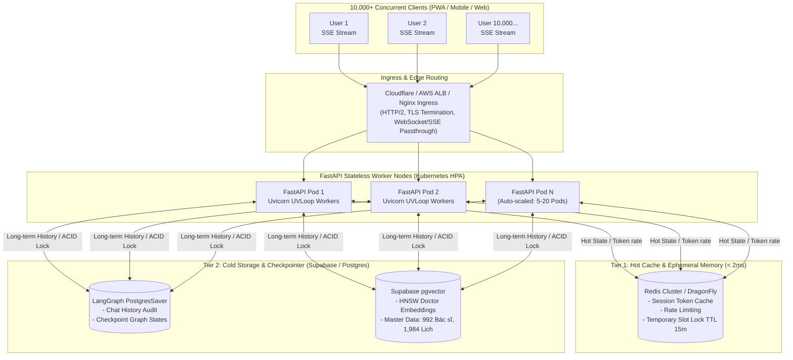

# BẢN THIẾT KẾ KIẾN TRÚC HIGH-CONCURRENCY HEALTHCARE AI AGENT (10,000+ CONCURRENT USERS)

**Dự án:** P-124 - AI Medical Triage & Booking Assistant
**Mục tiêu tải:** Chịu tải thực tế **10.000 người dùng đồng thời (10,000 CCU)**
**Tiêu chuẩn kiến trúc:** Cloud-native, Stateless API Gateway, Distributed Caching, Event-driven Streaming, Non-blocking I/O

---

## 1. MÔ HÌNH HIỆN ĐẠI NHẤT HIỆN NAY (STATE-OF-THE-ART ARCHITECTURE)

Để phục vụ 10.000 người dùng chat đồng thời, **tuyệt đối không thể dùng kiến trúc Monolith lưu State trong RAM của 1 server (như MemorySaver đơn thuần)** vì:
- 10.000 sessions trong RAM sẽ gây tràn bộ nhớ (Out-Of-Memory).
- Khi server restart hoặc auto-scale ra 5 pods khác nhau, user gửi tin nhắn tiếp theo sẽ bị mất toàn bộ ngữ cảnh (mất session).

### 🏆 Mô hình chuẩn công nghiệp hiện nay: **Decoupled Stateless Agent + Redis Ephemeral State + Postgres Checkpointer**

---

## 2. NĂM TRỤ CỘT ĐỂ GÁNH 10.000 NGƯỜI DÙNG ĐỒNG THỜI

### 1. Stateless API Nodes & Async I/O (FastAPI + uvloop)
- Mỗi Pod FastAPI chỉ chạy các tác vụ thuần bất đồng bộ (`async / await`).
- Tuyệt đối không dùng thư viện blocking (như `requests`, `time.sleep()`).
- Băng thông mạng cho SSE cực nhẹ: 1 request SSE chỉ giữ 1 kết nối TCP nhẹ, tiêu tốn khoảng **5-10 KB RAM**. 10.000 kết nối chỉ tốn khoảng **100MB - 200MB RAM** mạng.

### 2. Distributed Session Checkpointing (Redis + PostgresSaver)
- Thay vì `MemorySaver()` cục bộ trong tiến trình Python:
  - **Lớp nóng (Hot State):** Dùng `RedisSaver` (hoặc Redis cache) lưu trữ 10 lượt chat gần nhất để Agent trả lời tức thì trong **2ms**.
  - **Lớp nguội (Cold State):** Ghi bất đồng bộ xuống bảng `checkpoints` của **Postgres** để lưu trữ vĩnh viễn và phục vụ Lễ tân duyệt (HITL).

### 3. Connection Pooling & Transaction Isolation
- Kết nối Supabase: Bắt buộc dùng **Supavisor (PgBouncer Connection Pooler)** ở mode Transaction.
- Tránh việc 10.000 request mở 10.000 connection trực tiếp vào PostgreSQL làm sập database. Connection pool giới hạn ở mức 50-100 connections được tái sử dụng liên tục.

### 4. Semantic Caching cho RAG & LLM
- Khoảng **40% - 60%** người bệnh sẽ hỏi các câu trùng lặp: *"Khoa Thần kinh khám ở cơ sở nào?"*, *"Giá gói tầm soát đột quỵ bao nhiêu?"*, *"Khám tổng quát có cần nhịn ăn không?"*.
- Sử dụng **Semantic Cache (GPTCache hoặc Redis Vector)**: Nếu câu hỏi tương đồng ngữ nghĩa > 95% với câu hỏi đã có trong cache trong 24 giờ qua $\rightarrow$ Trả về kết quả ngay trong **5 millisecond**, **tiết kiệm 100% chi phí token và giải phóng tài nguyên LLM**.

### 5. Optimistic Concurrency Control (Chống kẹt khi 10.000 người cùng bấm đặt lịch)
- Sử dụng Redis Distributed Lock (`Redlock`) hoặc SQL `SELECT ... FOR UPDATE SKIP LOCKED` khi khóa slot khám.
- Nếu slot đã bị người khác giữ $\rightarrow$ Trả về ngay gợi ý slot tiếp theo trong 50ms mà không bị treo request (Deadlock).
