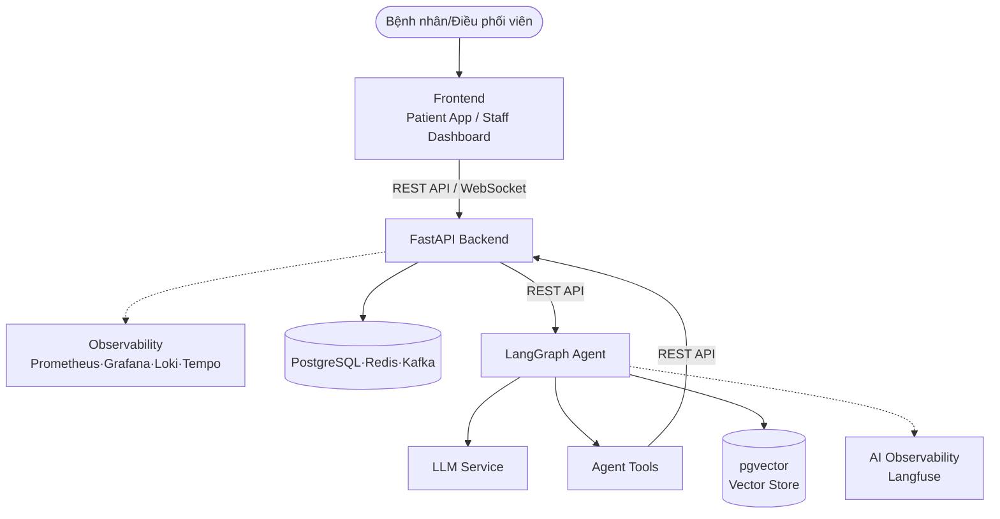
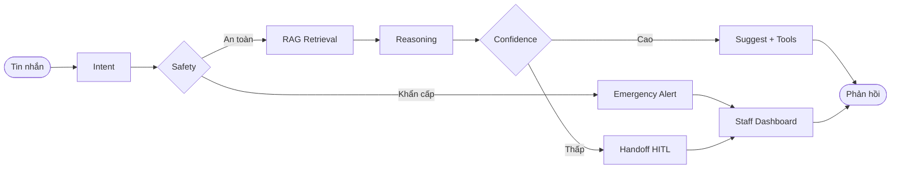

# Architecture Diagram

## System Overview

## Agent Flow

## Component Details

| Component        | Technology                    | Purpose                                                                                 |
| ---------------- | ----------------------------- | --------------------------------------------------------------------------------------- |
| Frontend         | React (Vercel)                | Giao diện Patient App & Staff Dashboard                                                 |
| Backend          | FastAPI                       | Lớp duy nhất ghi dữ liệu, thực thi nghiệp vụ (Auth, Appointment, HITL, Notification...) |
| Agent            | LangGraph                     | Điều phối luồng tư vấn AI (Intent, Safety, RAG, Reasoning, Confidence)                  |
| LLM              | OpenAI/Gemini                 | Language model cho Agent (Intent Detection, Reasoning)                                  |
| Database         | PostgreSQL                    | Data persistence + cache (Redis) + message queue (Kafka)                                |
| Vector Store     | pgvector                      | RAG / embeddings, chỉ dùng riêng cho Agent                                              |
| Observability    | Prometheus·Grafana·Loki·Tempo | Metrics, logs, traces cho Backend                                                       |
| AI Observability | Langfuse                      | Theo dõi reasoning, tool calls, confidence của Agent                                    |
