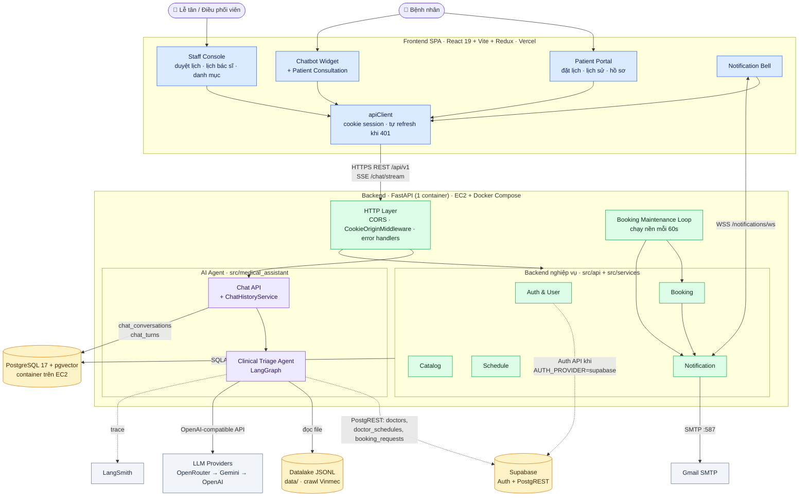
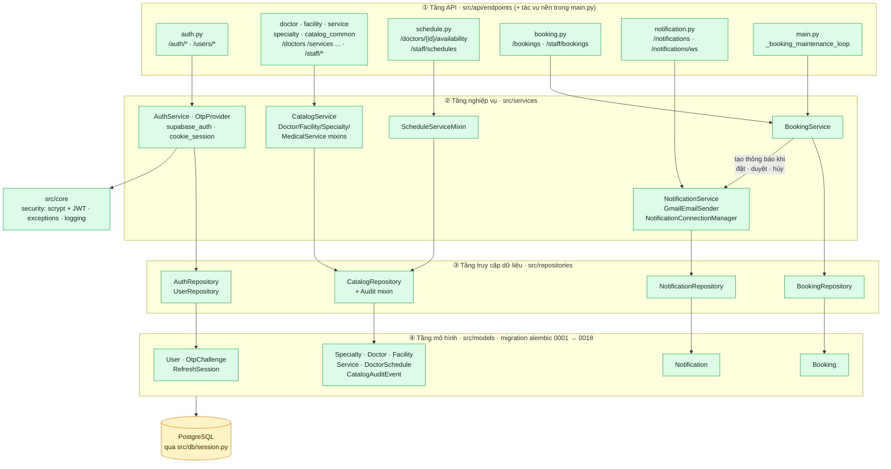
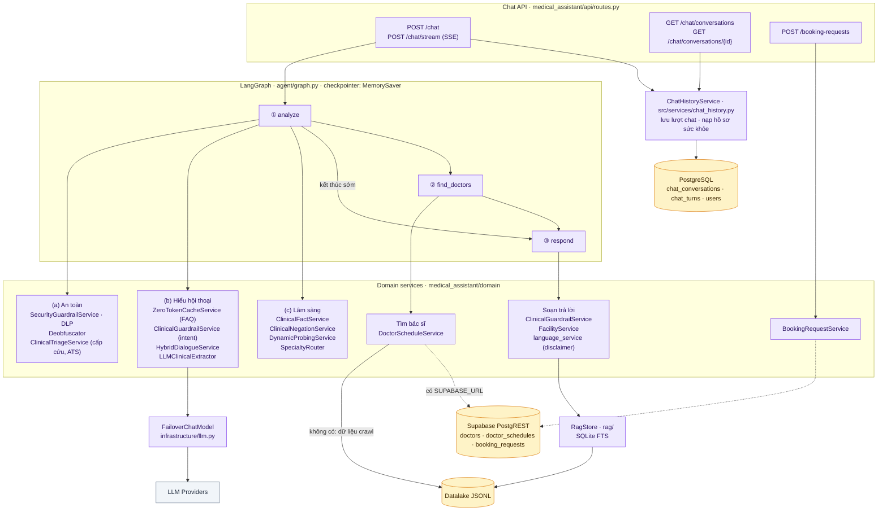

# Component Diagram — VCare+ (P-124)

> **Phạm vi:** mô tả các thành phần (component) của hệ thống, trách nhiệm của từng thành phần và cách chúng phụ thuộc/giao tiếp với nhau.
> Luồng dữ liệu theo thời gian (dữ liệu đi qua những bước nào) được mô tả riêng trong **Data Flow Diagram**.
>
> **Căn cứ:** code nhánh `develop` @ `aadaa7f` (02/10/2026). Khi kiến trúc thay đổi, cập nhật lại tài liệu này cùng PR thay đổi code.

## Mục lục

1. [Tổng quan hệ thống](#1-tổng-quan-hệ-thống)
2. [Thành phần bên trong Backend nghiệp vụ](#2-thành-phần-bên-trong-backend-nghiệp-vụ)
3. [Thành phần bên trong AI Agent](#3-thành-phần-bên-trong-ai-agent)
4. [Bảng mô tả thành phần](#4-bảng-mô-tả-thành-phần)
5. [Giao diện giữa các thành phần](#5-giao-diện-giữa-các-thành-phần)
6. [Lưu ý hiện trạng](#6-lưu-ý-hiện-trạng)

**Quy ước màu** dùng chung cho cả 3 sơ đồ:

| Màu | Ý nghĩa |
|---|---|
| 🟦 Xanh dương | Frontend |
| 🟩 Xanh lá | Backend nghiệp vụ |
| 🟪 Tím | AI Agent |
| 🟨 Vàng | Lưu trữ dữ liệu |
| ⬜ Xám | Dịch vụ bên ngoài |

Mũi tên liền là phụ thuộc bắt buộc. Mũi tên nét đứt là phụ thuộc tùy chọn: chỉ chạy khi có cấu hình tương ứng.

---

## 1. Tổng quan hệ thống

Hệ thống gồm 1 ứng dụng frontend (SPA) và 1 ứng dụng backend FastAPI. Bên trong backend có 2 khối: **Backend nghiệp vụ** và **AI Agent**.

---

## 2. Thành phần bên trong Backend nghiệp vụ

Backend nghiệp vụ chia **4 tầng**: Endpoint → Service → Repository → Model. Endpoint không truy vấn DB trực tiếp mà gọi Service; endpoint chỉ import Model để khai báo kiểu, ví dụ `User`. Mỗi module (Auth, Catalog, Booking, Notification) là một "lát dọc" đi qua cả 4 tầng.

**Phân quyền:**
- Mọi endpoint dưới `/staff/*` đều đi qua `require_staff`.
- Các endpoint còn lại (xem danh mục, xem lịch trống, đặt/hủy/đổi lịch) chỉ yêu cầu đăng nhập qua `get_current_user`.
- `require_patient` đã được định nghĩa trong `dependencies.py` nhưng chưa route nào dùng.
- Token được đọc từ header `Authorization: Bearer` hoặc từ cookie `p124_access`.

---

## 3. Thành phần bên trong AI Agent

Agent là một đồ thị LangGraph 3 node. Phần lớn logic nằm trong các **domain service** mà node `analyze` gọi lần lượt.

**Cách đọc:**
- Node `analyze` gọi 3 nhóm service theo thứ tự **(a) → (b) → (c)**:
  - (a) An toàn: bảo mật đầu vào, rồi kiểm tra cấp cứu.
  - (b) Hiểu hội thoại: cache FAQ, intent/guardrail, rồi LLM.
  - (c) Lâm sàng: trích dữ kiện, xử lý phủ định, hỏi thêm, chọn chuyên khoa.
- Ở bất kỳ bước nào, nếu gặp ca cấp cứu, bị chặn, câu FAQ, hay cần hỏi thêm, đồ thị sẽ **kết thúc sớm** và đi thẳng tới `respond`, bỏ qua `find_doctors`.
- Các nhóm service là module Python được gọi trực tiếp trong cùng tiến trình, không phải service mạng riêng.

---

## 4. Bảng mô tả thành phần

### Frontend (`frontend/`)

| Thành phần | Code | Trách nhiệm |
|---|---|---|
| Patient Portal | `pages/AppointmentBooking`, `AppointmentHistory`, `AppointmentDetail`, `AppointmentProgress`, `PatientProfile`, `PatientDepartments` | Đặt lịch, theo dõi trạng thái lịch, quản lý hồ sơ sức khỏe |
| Chatbot Widget | `layouts/ChatbotWidget.tsx`, `pages/PatientConsultation`, `features/chat/api.ts` | Hội thoại với agent qua SSE, gửi yêu cầu đặt lịch từ chat |
| Staff Console | `pages/StaffDashboard`, `AppointmentApproval`, `ScheduleApprove`, `DoctorSchedule`, `DoctorManagement`, `ServiceManagement`, `ChatTakeover`, `EmergencyCoordinator` | Duyệt lịch, quản lý lịch bác sĩ và danh mục, điều phối |
| Notification Bell | `features/notification/` | Nhận thông báo realtime qua WebSocket, đánh dấu đã đọc |
| apiClient | `app/apiClient.ts` | Gọi `/api/v1`, gửi cookie session, tự refresh token khi gặp 401 |

### Backend nghiệp vụ (`src/`)

| Thành phần | Code | Trách nhiệm | Phụ thuộc |
|---|---|---|---|
| HTTP Layer | `main.py`, `api/handlers.py`, `services/cookie_session.py` | CORS; chặn request ghi dữ liệu dùng cookie nếu `Origin` không nằm trong danh sách cho phép; chuẩn hóa lỗi | — |
| Auth & User | `api/endpoints/auth.py`, `services/auth.py`, `services/otp.py`, `services/supabase_auth.py`, `core/security.py` | Đăng ký, OTP, đăng nhập, refresh token, phiên đăng nhập, hồ sơ người dùng | PostgreSQL; Supabase Auth (tùy chọn) |
| Catalog | `api/endpoints/catalog*.py`, `doctor.py`, `facility.py`, `service.py`, `specialty.py`, `services/catalog.py` | CRUD khoa, bác sĩ, dịch vụ, cơ sở; ghi audit log | PostgreSQL |
| Schedule | `api/endpoints/schedule.py`, `services/schedule.py` | Lịch làm việc của bác sĩ, chống trùng giờ, import hàng loạt | Catalog |
| Booking | `api/endpoints/booking.py`, `services/booking.py` | Tạo, hủy, đổi lịch; lễ tân duyệt/từ chối (`pending_approval` → `confirmed`/`rejected`) | Schedule, Catalog, Notification |
| Notification | `api/endpoints/notification.py`, `services/notification.py`, `services/email.py`, `realtime/notifications.py` | Thông báo trong app, đẩy WebSocket, hàng đợi email | PostgreSQL, Gmail SMTP |
| Booking Maintenance Loop | `main.py · _booking_maintenance_loop` | Chạy nền: cho booking quá hạn hết hạn, tạo nhắc lịch, gửi email đang chờ | Booking, Notification |

### AI Agent (`src/medical_assistant/`)

| Thành phần | Code | Trách nhiệm | Phụ thuộc |
|---|---|---|---|
| Chat API | `api/routes.py` | Nhận tin nhắn, stream phản hồi (SSE), trả lịch sử hội thoại, nhận yêu cầu đặt lịch | Agent, ChatHistoryService |
| ChatHistoryService | `src/services/chat_history.py` | Với người đã đăng nhập: lưu từng lượt chat, lưu và khôi phục state rút gọn, nạp hồ sơ sức khỏe vào agent | PostgreSQL (bảng tạo bằng `scripts/sql/chat_history.sql`) |
| Clinical Triage Agent | `agent/graph.py`, `agent/nodes/`, `agent/state.py` | Điều phối 3 node `analyze` → `find_doctors` → `respond` | Domain services |
| Security Guardrail | `domain/security/` | Chặn prompt injection, che PII, gỡ chữ bị làm rối | — |
| Triage | `domain/triage_service.py`, `domain/disease_triage.py` | Phát hiện cấp cứu (red flag), chấm mức ATS | — |
| Clinical Guardrail | `domain/guardrail_service.py` | Nhận diện intent, từ chối chẩn đoán/kê thuốc, trả lời thông tin khoa | RagStore |
| Dialogue & Facts | `domain/hybrid_dialogue_service.py`, `llm_clinical_extractor.py`, `clinical_fact_service.py`, `clinical_negation_service.py`, `probing_service.py` | Hiểu hội thoại bằng LLM, trích triệu chứng, xử lý phủ định, sinh câu hỏi làm rõ | LLM |
| Specialty Router | `domain/specialty_router.py` | Chọn chuyên khoa phù hợp từ triệu chứng | — |
| Doctor Schedule | `domain/doctor_schedule_service.py` | Tìm bác sĩ và khung giờ trống | Supabase hoặc Datalake |
| Booking Request | `domain/booking_request_service.py` | Lưu yêu cầu đặt lịch từ chat vào hàng đợi `booking_requests` | Supabase |
| RAG | `rag/service.py`, `rag/store_cache.py` | Tìm kiếm full-text trên dữ liệu JSONL, trả kèm nguồn | Datalake |
| LLM Gateway | `infrastructure/llm.py` | Gọi LLM qua API tương thích OpenAI, tự chuyển provider khi lỗi | OpenRouter / Gemini / OpenAI |
| Ingestion (offline) | `ingestion/` | Crawl và chuẩn hóa dữ liệu Vinmec (bác sĩ, khoa, dịch vụ, bệnh viện, bệnh) thành JSONL | — |

---

## 5. Giao diện giữa các thành phần

| Từ | Đến | Giao thức | Điểm cuối / cơ chế |
|---|---|---|---|
| Frontend | Backend | HTTPS REST | `/api/v1/*`, xác thực bằng cookie `p124_access`/`p124_refresh` hoặc header `Bearer` |
| Chatbot Widget | Chat API | Server-Sent Events | `POST /api/v1/chat/stream`: event `init` → `token` → `metadata` → `[DONE]` |
| Notification Bell | Notification | WebSocket | `/api/v1/notifications/ws` |
| Booking | Notification | Gọi hàm trong cùng tiến trình | `NotificationService.create_for_booking_*` |
| Notification | Bell đang mở | WebSocket push | `NotificationConnectionManager.publish(user_id, payload)` |
| Backend nghiệp vụ, ChatHistory | PostgreSQL | SQLAlchemy async (psycopg 3) | `DATABASE_URL` |
| Agent | Supabase | HTTP PostgREST | `SUPABASE_URL/rest/v1/{table}` (tùy chọn) |
| Auth | Supabase | HTTP | `SUPABASE_URL/auth/v1/*` khi `AUTH_PROVIDER=supabase` |
| Agent | LLM | HTTPS, OpenAI-compatible | Thứ tự dự phòng OpenRouter → Gemini → OpenAI |
| Notification | Gmail | SMTP STARTTLS :587 | `GMAIL_SMTP_*` |

---

## 6. Lưu ý hiện trạng

Các điểm dưới đây giúp người đọc hiểu đúng sơ đồ. Chúng là hiện trạng của code, không phải thiết kế mong muốn.

1. **Hai nguồn dữ liệu bác sĩ.**
   - Backend nghiệp vụ dùng bảng `doctors` / `doctor_schedules` trong PostgreSQL (schema do Alembic quản lý).
   - Agent đọc bảng `doctors` bên Supabase. Bảng này có thêm các trường crawl như `source_profile`, `source_system`, `external_id`.
   - Hai bảng không đồng bộ với nhau. Yêu cầu đặt lịch từ chat ghi vào `booking_requests` (Supabase), không vào `bookings` mà trang duyệt lịch đang đọc.
2. **Bộ nhớ hội thoại có 2 lớp.**
   - LangGraph dùng `MemorySaver`, lưu trong RAM.
   - Với người **đã đăng nhập**, `ChatHistoryService` lưu thêm một bản rút gọn của state (các trường trong `STATE_FIELDS`) vào cột `chat_conversations.checkpoint` (jsonb) và nạp lại ở mỗi lượt, nên restart server không mất ngữ cảnh.
   - Với **khách chưa đăng nhập**, state chỉ nằm trong RAM và sẽ mất khi restart.
3. **WebSocket thông báo được giữ trong RAM** của tiến trình. Chạy nhiều instance backend thì thông báo realtime chỉ tới được người đang kết nối vào đúng instance đó.
4. **Chat Takeover** đã có bảng (migration `0018_chat_takeover`), nhưng chưa có API. Giao diện `pages/ChatTakeover` đang dùng dữ liệu mẫu (`mockData.ts`).
5. **Bảng `chat_conversations`, `chat_turns`** được tạo bằng script `scripts/sql/chat_history.sql`, không qua Alembic.
6. **Code không còn được dùng.** Ứng dụng thực tế khởi động từ `src/main.py`. Các file sau không nằm trên đường chạy và không được vẽ trong sơ đồ:
   - `src/api/routes.py` + `src/agents/`: agent mẫu của template. Router này không được `main.py` gắn vào.
   - `src/models/tables.py`: schema cũ dùng id kiểu int, không còn được import.
   - `src/medical_assistant/main.py`: app chạy riêng cũ của chatbot.
