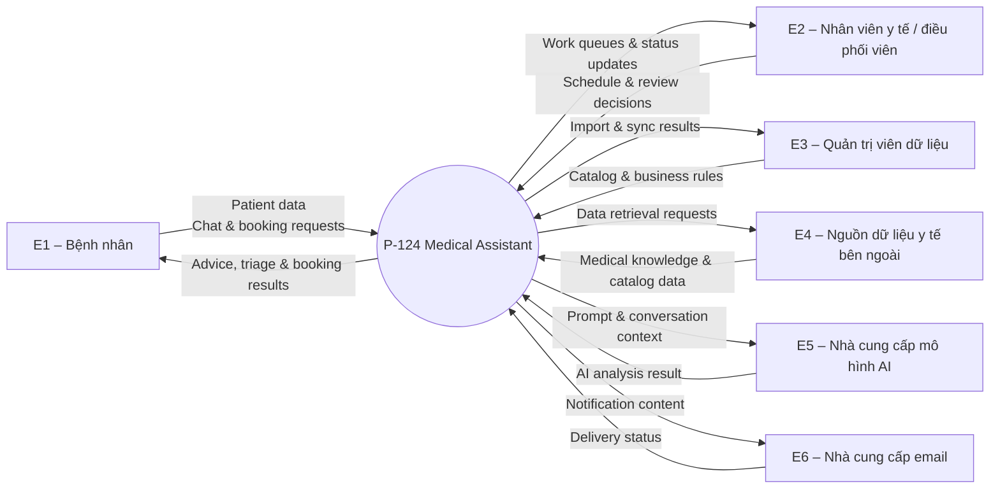
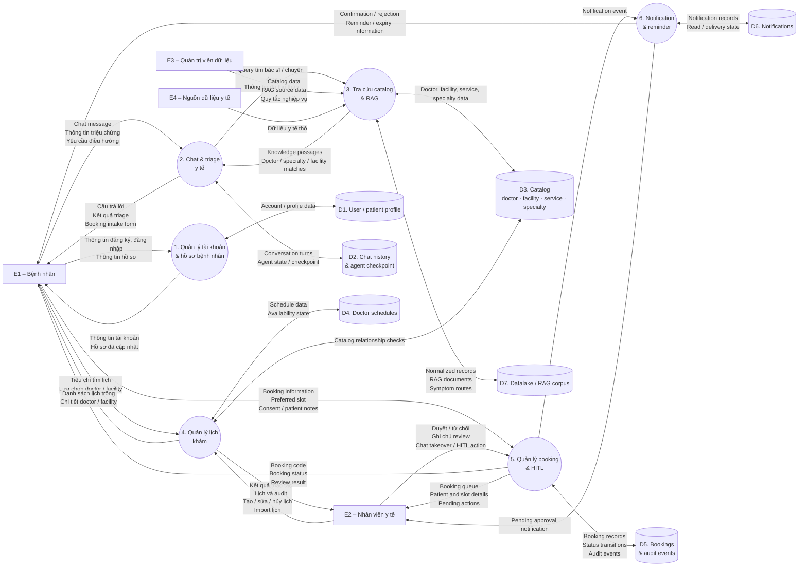

# Sơ đồ Data Flow – P-124 Medical Assistant

Tài liệu này dùng quy ước DFD:

- Nhãn trên edge là **dữ liệu được trao đổi**: chat message, patient profile, booking information, schedule data…
- Cách truyền dữ liệu như REST, SSE, WebSocket hoặc SMTP chỉ là chi tiết kỹ thuật và được ghi ở phần ghi chú, không dùng làm nhãn DFD.
- Level 0 là context diagram của toàn hệ thống.
- Level 1 phân rã hệ thống thành các quy trình nghiệp vụ chính.
- Level 2 phân rã sâu hơn các quy trình chat, booking và tạo lịch.

## Level 0 – Context diagram

Level 0 xem P-124 như một hệ thống duy nhất và chỉ mô tả dữ liệu trao đổi với các tác nhân bên ngoài.

## Level 1 – Phân rã các quy trình chính

## Level 2 – Chi tiết các quy trình

Tất cả subprocess của level 2 được trình bày trong một hình duy nhất.

```mermaid
flowchart LR
    Patient["Bệnh nhân"]
    Staff["Nhân viên y tế"]
    Agent["Agent / Chat context"]
    D2[("D2. Chat history\n& checkpoint")]
    D3[("D3. Catalog")]
    D4[("D4. Doctor schedules")]
    D5[("D5. Bookings\n& booking requests")]
    D6[("D6. Notifications")]
    D7[("D7. RAG corpus\n& FTS5 index")]

    subgraph CHAT["2. Chat & triage"]
        direction TB
        C1(("2.1 Receive message"))
        C2(("2.2 Security & privacy"))
        C3(("2.3 Intent & language"))
        C4(("2.4 ATS / emergency triage"))
        C5(("2.5 Collect missing details"))
        C6(("2.6 Retrieve knowledge\n& availability"))
        C7(("2.7 Compose response"))
        C1 --> C2 --> C3 --> C4
        C4 -->|"Need more details"| C5 --> C7
        C4 -->|"Safe and actionable"| C6 --> C7
        C4 -->|"Emergency / blocked"| C7
    end

    subgraph BOOKING["5. Booking & HITL"]
        direction TB
        B1(("5.1 Read booking context"))
        B2(("5.2 Validate patient\nconsent and slot"))
        B3{"Slot valid?"}
        B4(("5.3 Create booking\nrequest / record"))
        B5(("5.4 Queue for staff"))
        B6(("5.5 Staff review"))
        B7(("5.6 Update status\n& audit"))
        B1 --> B2 --> B3
        B3 -->|"Yes"| B4 --> B5 --> B6 --> B7
        B3 -->|"No"| B2
    end

    subgraph SCHEDULE["4. Schedule management"]
        direction TB
        S1(("4.1 Enter schedule"))
        S2(("4.2 Validate catalog links"))
        S3(("4.3 Check overlap"))
        S4(("4.4 Create / update schedule"))
        S5(("4.5 Publish availability"))
        S1 --> S2 --> S3 --> S4 --> S5
    end

    subgraph NOTIFY["6. Notification & reminder"]
        direction TB
        N1(("6.1 Create notification"))
        N2(("6.2 Persist delivery state"))
        N3(("6.3 Deliver in-app / email"))
        N1 --> N2 --> N3
    end

    Patient -->|"Chat message / symptoms"| C1
    C7 -->|"Advice / triage / booking intake"| Patient
    C6 -->|"Knowledge query"| D7
    D7 -->|"Passages / sources"| C6
    C6 -->|"Doctor / slot query"| D3
    D3 -->|"Catalog matches"| C6
    C7 <--> |"Conversation state"| D2

    C7 -->|"Booking intake"| B1
    Patient -->|"Patient data / selected slot"| B2
    B1 <--> D2
    B2 <--> D4
    B4 <--> D5
    B5 -->|"Pending booking"| Staff
    Staff -->|"Review decision"| B6
    B7 <--> D5
    B7 -->|"Booking event"| N1
    B7 -->|"Review result"| Patient

    Staff -->|"Schedule information"| S1
    S4 <--> D4
    S2 <--> D3
    S5 -->|"Availability data"| Patient
    S5 -->|"Availability data"| C6

    N2 <--> D6
    N3 -->|"Confirmation / reminder"| Patient
    N3 -->|"Approval notification"| Staff
```

## Mapping data store với code

| Data store | Dữ liệu chính | Thành phần liên quan |
|---|---|---|
| D1 – User / patient profile | Tài khoản, role, thông tin bệnh nhân, session | `src/models/user.py`, auth endpoints, `UserRepository` |
| D2 – Chat history / checkpoint | Conversation, turns, result, agent state | `ChatHistoryService`, `MemorySaver`, `chat_conversations`, `chat_turns` |
| D3 – Catalog | Doctor, facility, service, specialty và liên kết | `src/models/*.py`, catalog endpoints |
| D4 – Doctor schedules | Slot, thời gian, availability, overlap state | `src/models/schedule.py`, schedule endpoints |
| D5 – Booking / audit | Booking, booking request, review status, audit | `BookingService`, `BookingRequestService`, audit repository |
| D6 – Notifications | In-app notification, email status, read state | `NotificationService`, notification repository |
| D7 – Datalake / RAG | JSONL normalized, RAG documents, symptom routes | `data/datalake`, ingestion pipeline, `RagStore` |

## Ghi chú kỹ thuật, tách khỏi DFD

- Frontend hiện dùng HTTP API cho request/response; chat stream dùng SSE và notification realtime dùng WebSocket.
- Chat authenticated được archive vào PostgreSQL; agent state trong `MemorySaver` là state runtime theo `thread_id`.
- `booking_requests` của chatbot được ghi qua Supabase PostgREST với trạng thái `PENDING_CONTACT`; đây là yêu cầu chờ điều phối viên liên hệ, chưa phải booking đã xác nhận.
- Booking authenticated đi qua PostgreSQL/SQLAlchemy và thường có trạng thái `pending_approval` → `confirmed` hoặc `rejected`.
- Dữ liệu crawl được build vào `data/datalake`; `RagStore` nạp các file JSONL vào chỉ mục SQLite FTS5 in-memory khi khởi động.
- Emergency hoặc case không an toàn được chặn khỏi booking flow thông thường và trả về hướng dẫn an toàn.
- `src/agents` và `src/api/routes.py` vẫn tồn tại như agent mẫu/legacy; entry point runtime chính hiện tại là router trong `src/medical_assistant/api/routes.py`, được mount bởi `src/main.py`.

